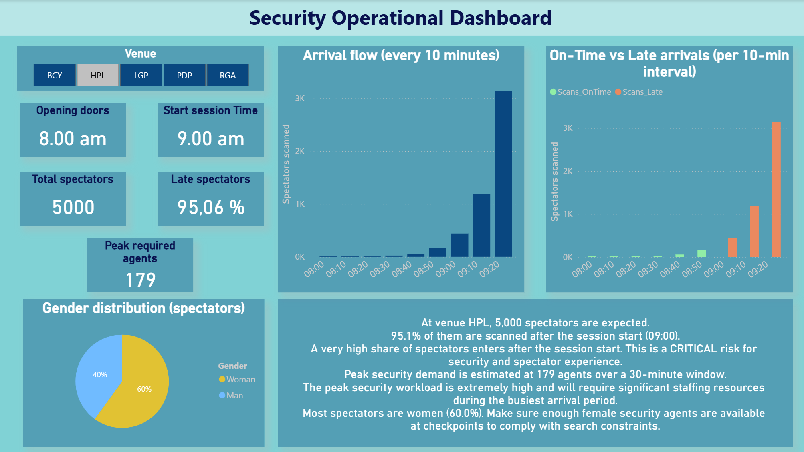

# 🏟️ Operational Analytics for a Sporting Event

End-to-end data analysis project focused on operational optimization for a large-scale sporting event, using ticket scan data to support decision-making on event day.

## 🎯 Project objectives
- Analyze spectator arrival patterns and peak periods
- Support operational planning (staffing, security, services)
- Provide actionable insights for event-day coordination

## 📓 Analysis notebook
The full analysis is available in the Jupyter notebook:

➡️ [Open the analysis notebook](notebooks/sport.ipynb)

The notebook covers:
- Exploration of ticket scan data
- Identification of arrival peaks and late arrivals
- KPI definition for operational planning
- Business-oriented interpretation of results

## 📊 Power BI Dashboard
The Power BI dashboard is illustrated with screenshots:

➡️ [View Power BI dashboard screenshots](powerbi/screenshots/)

### Dashboard preview

The dashboard focuses on:
- Arrival flows over time
- Anticipation of peak periods
- Operational KPIs for field teams
- Decision-oriented views for non-technical users

## 📁 Dataset
Event ticket scan data (not included in this repository).

**Note:** raw data is not shared due to confidentiality constraints.

## 🛠️ Tools
- Python (pandas)
- Jupyter Notebook
- Power BI
